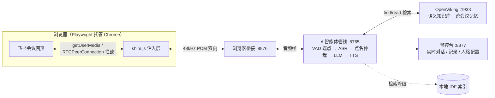

# 星火 · 会议分身

你的 AI 会议分身：代替你进入飞书会议——**听会、记录、被点名时回答、需要你本人拍板的事记下来转达给你**。

*An AI meeting delegate for Feishu (Lark): it listens, transcribes, answers when addressed, and escalates decisions back to you.*

开箱即用，知识库默认空（不绑定任何个人信息），分身的人格与限制在网页里随时维护。

## 它能做什么

| 能力 | 说明 |
|---|---|
| 听会记录 | 全场会议语音实时转文字落盘，随时回看（监控台 · 会议记录） |
| 被点名回答 | 参会者喊唤醒词（默认「星火」，可自配多个），它基于本场会议内容与知识库简洁回答 |
| 待本人决策 | 遇到需要你本人解释/承诺/拍板的问题（价格、排期、人事、对外承诺），它不替你回答，记录到「待本人回答」列表并告知提问者会转达 |
| 看聊天回帖 | 会议聊天里 @它的消息，语音回答 + 文字回帖 |
| 看投屏 | 问「你看下投屏」，它能描述共享屏幕的画面内容 |
| 妙记同步（可选） | 浏览器里开着妙记详情页时，自动同步飞书高保真转写作为会议记录基准 |

## 技术上有意思的地方

市面上多数"会议机器人"走的是 SDK 机器人或虚拟声卡路线，这个项目选了更难但更通用的一条：**直接操作飞书会议网页版**。Playwright 启动 Chrome，`add_init_script` 注入 shim 层，拦截 `getUserMedia` 返回合成麦克风轨（上行发声）、包装 `RTCPeerConnection` 捕获远端音频轨（下行收听），页面内 WebSocket 双向传输 48kHz 单声道 PCM。任何能用网页版开的会，分身都能进，不依赖会议创建者授权机器人。

语音实时性按会议场景做了全链路预算控制：会议室有人说完话到分身开口，端到端小于 2 秒。为此做了三件事——TTS 长连接预热消除首句握手延迟；参会者还在说话时就用 interim ASR 结果预检索知识库（warm prefetch），轮到分身回答时检索成本约等于零；知识库语义检索全链路实测平均 62ms、p95 114ms，超出 800ms 预算即熔断，自动降级为本地关键词检索（实测降级后 2.9ms），会议回复永不卡死。

知识检索走"语义优先、关键词兜底"双引擎：优先由 [OpenViking](https://github.com/volcengine/OpenViking)（火山引擎开源的 Agent 上下文数据库）做语义召回，embedding 用本地 Ollama 跑的 bge-m3——实时路径零外部 API 依赖、零费用，中文 POC 实测 6/6 问题全命中；OpenViking 不在或异常时，无缝回退到内置的 bigram + IDF 关键词索引。

## 架构



五个组件由 `./start.sh` 一键拉起：

| 端口 | 组件 | 作用 |
|---|---|---|
| 1933 | OpenViking 上下文数据库（可选） | 知识库语义检索与跨会议记忆；未就绪时自动降级关键词检索 |
| 8765 | A 智能体管线 | 听声音、判唤醒、发声音 |
| 8766 | B 智能体 | 分身大脑：会议记忆、待决识别、回答生成 |
| 8876 | 浏览器桥接 | 音频双向通道 |
| 8877 | 监控台 | 实时对话、会议记录、待本人回答、人格配置 |

技术栈：Python 3.14（管线/监控）+ Python 3.10（OpenViking）· FastAPI + WebSocket · Playwright · 火山引擎（豆包 LLM / Seed-ASR / Seed-TTS，可换 Apple 本机识别）· Ollama bge-m3。

## 五分钟上手

前置：macOS + Chrome 浏览器 + 一个火山引擎（豆包）API Key。

1. **启动**：终端进入项目目录，执行 `./start.sh 会议号`（不带会议号则浏览器打开后手动输入）。
2. **登录**：首次打开浏览器需扫码登录飞书（登录态持久保存，之后免登），进入会议。
3. **配置**：打开监控台 `http://127.0.0.1:8877/` →「系统配置」页：
   - 填入**火山引擎 API Key**（语音与大脑都用它）
   - 设置**唤醒词**（多个用逗号分隔，如「星火，小王，王工」）
   - 维护**分身人格与限制**（它是谁、能说什么、不能说什么——一个大文本框，改完保存数秒内生效）
4. **使用**：会议里任何人喊唤醒词提问即可；喊「别说了」立即静音。

> OpenViking 依赖本机 Ollama 与 python@3.10，`./start.sh` 会自动安装并拉取 bge-m3 模型（约 1.2GB，仅首次）；
> 首次运行会生成 `ov_runtime/ov.conf`，按提示填入火山引擎 Key 后重跑脚本即可。
> 不配也能正常开会，只是知识库退回关键词检索。

## 知识库（可选，默认空）

默认空库——它只依据本场会议内容回答，不掌握你的任何背景信息。

想让它懂业务：把 Markdown 文档放进项目根目录的 `kb/` 文件夹（支持软链接指向外部目录），监控台点「重建索引」即可。索引是双写：本地关键词索引秒级完成，语义索引进 OpenViking（每篇约 30 秒生成智能摘要，一次性）。随着 FAQ、产品说明、历史纪要逐步补进去，分身会越来越懂你。

## 人格与限制怎么写（监控台可维护）

监控台「系统配置 → 分身人格与行为限制」文本框就是它的"宪法"。默认模板：

```
你是用户的会议分身，代替用户参加飞书会议。你的首要职责是听清并记住会议内容，
在被点名时用简洁口语回答问题、同步信息。
行为规则：1. 先说结论，一到三句话，语气自然像本人说话，不用书面套话；
2. 只依据本场会议听到的内容回答，不知道就直说不知道，不编造、不猜测；
3. 遇到需要用户本人解释、承诺或拍板的问题，不要替用户回答——明确告诉提问者
「这个需要我本人来定，我已经记下来会转达，他确认后回复你」；
4. 用户说话、打断或要求停止时，立刻停止当前发言；
5. 不主动抢话，没有被点名就安静听会；
6. 需要表明身份时，说明自己是 AI 会议分身，不隐瞒。
```

按你的风格改：语气（正式/随意）、回答长度、哪些事必须转达本人、是否允许表明 AI 身份。

## 项目结构

```
server/            管线与监控台后端（FastAPI）
  engines/         pipeline 引擎：VAD、双声道状态机、响应组装
  asr/ llm/ tts/   可插拔引擎适配层（火山 / Apple / OpenAI 兼容）
  rag/             知识库：IDF 本地索引 + OpenViking 适配器（超时熔断降级）
  meeting/         点名仲裁、语义澄清、待本人决策识别
integrations/feishu/  浏览器桥接（Playwright、shim 注入、TTS 队列）
web/               新版监控台前端
02-研发实现/        旧版桥接与监控台（monitor_server.py 8877）
ov_runtime/        OpenViking 运行环境（venv / ov.conf / data，均不入库）
tests/             离线测试（仲裁、澄清、知识库、桥接绑定）
start.sh           一键启动（依赖自检、自动安装、降级提示）
```

## 隐私

- 音频实时流过本机，不录音；文字记录仅保存在你自己的电脑（`02-研发实现/transcripts/`，不入库）
- 语音识别/大模型/语音合成走你配置的火山引擎接口，Key 只存在本机 `config.json`（已 gitignore）
- 所有服务只监听 127.0.0.1，外部无法访问

## 常见问题

| 现象 | 怎么办 |
|---|---|
| 喊唤醒词没反应 | 看监控台实时对话流：你的话被转写成了什么（唤醒词被识别错可把谐音加进唤醒词列表） |
| 回答变慢（>5 秒） | 正常深度回答 2-4 秒；如果一致很慢，检查「系统配置」里深度思考是否被打开（应保持关闭） |
| 听到回声/自我打断 | 你在外放+开麦导致：戴耳机，或它回答时把你麦克风静音 |
| 换会议 | 浏览器里直接导航到新会议链接即可，不用重启；或 Ctrl+C 后 `./start.sh 新会议号` |
| 待本人回答在哪看 | 监控台首页右侧「待本人回答」卡片，可一键清空 |
| 知识库回答变笨 | 看监控台状态里 `kb.ov`：显示 `available: false` 说明 OpenViking 没在跑，已自动降级关键词检索，`./start.sh` 会拉起 |

## 路线图

- 跨会议记忆：散会后自动沉淀决策与待办，下场会议可召回（OpenViking session commit）
- 多会议并行旁听（当前限定单场）
- 更多会议平台（腾讯会议、Zoom 网页版，同一 shim 思路可迁移）

## License

MIT
